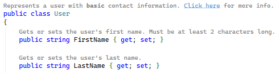
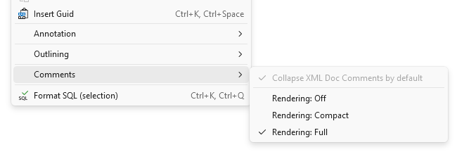
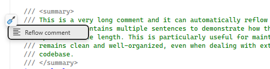
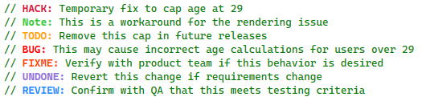
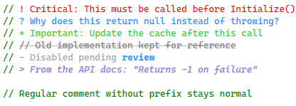
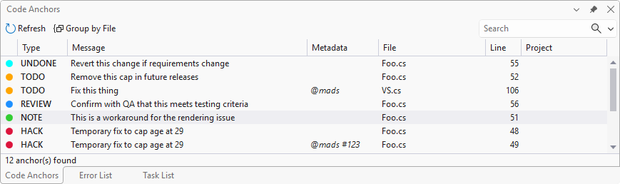
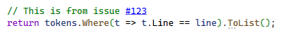
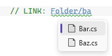
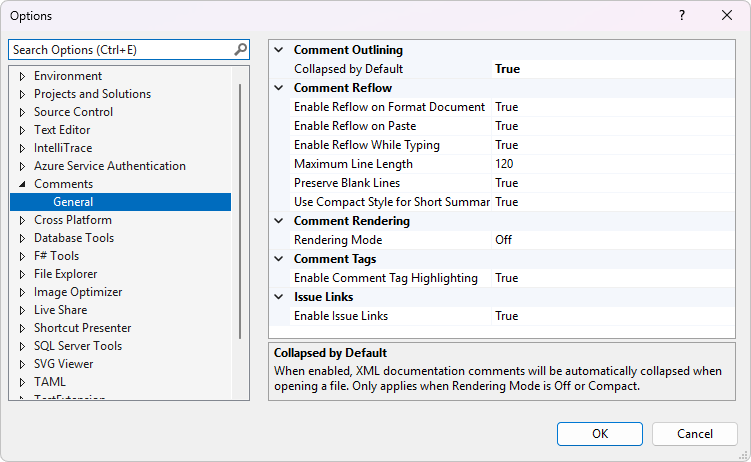

[marketplace]: https://marketplace.visualstudio.com/items?itemName=MadsKristensen.CommentsVS
[vsixgallery]: http://vsixgallery.com/extension/CommentsVS.38981599-e7f2-4db8-bf34-85b325aec2b6/
[repo]: https://github.com/madskristensen/CommentsVS

# Comment Studio for Visual Studio

[](https://github.com/madskristensen/CommentsVS/actions/workflows/build.yaml)
[][marketplace]
[][marketplace]
[][marketplace]

Download this extension from the [Visual Studio Marketplace][marketplace]
or get the [CI build][vsixgallery].

--------------------------------------

**Stop wrestling with XML documentation comments.** Comment Studio transforms how you write, read, and maintain code documentation in Visual Studio.



## ✨ Key Features at a Glance

- **Rendered Comments** — View XML docs as clean, formatted text (no XML noise)
- **Markdown Support** — Use `**bold**`, `*italic*`, `` `code` ``, and `[links](url)` in comments
- **Auto-Reflow** — Automatically wrap comments to your preferred line length
- **Collapse/Expand** — Hide comment blocks to focus on code, expand when needed
- **Color-coded Anchor Tags** — TODO, HACK, BUG, FIXME, NOTE highlighted in distinct colors, plus custom tags
- **Better Comments Style** — Prefix-based highlighting (`!`, `?`, `*`, `//`, `-`, `>`) for visual differentiation
- **Solution-Wide Code Anchors** — Browse all TODOs, HACKs, and notes across your entire solution
- **Clickable Issues** — `#123` links directly to GitHub/GitLab/Azure DevOps issues
- **Link Anchors** — Navigate to other files, lines, or named anchors with `LINK:` syntax
- **Theme-aware** — Works with light and dark Visual Studio themes

**Supports:** C#, VB.NET, F#, C++, TypeScript, JavaScript, Razor, SQL, and PowerShell

## Why Comment Studio?

XML documentation comments are essential for IntelliSense and API documentation, but they come with frustrations:

- **Hard to read** – XML tags clutter the actual documentation content
- **Tedious to format** – Manual line wrapping and alignment is time-consuming
- **Visual noise** – Long comment blocks obscure the code you're trying to read
- **Easy to miss important notes** – TODO and HACK comments blend into the code

Comment Studio solves all of these problems, letting you focus on writing great documentation instead of fighting with formatting.

## Features

### Comment Rendering Modes
**See your documentation, not the XML.** Choose how you want to view comments:

| Mode | Description |
|------|-------------|
| **Off** | Raw XML syntax with standard Visual Studio coloring |
| **Compact** | Collapse comments to a single line showing just the summary text |
| **Full** | Rich formatted rendering—read documentation like a web page |

Select your preferred mode from the **Edit > Comments** menu or right-click context menu. The active mode is indicated with a checkmark.

### Comment Outlining/Collapsing
**Reduce visual clutter instantly.** Collapse XML documentation comments to focus on your code. Expand them only when you need to read or edit.

Use **Ctrl+M, Ctrl+C** to toggle all XML doc comments in the current file between collapsed and expanded states.

You can also enable **Collapse XML Doc Comments by Default** from the **Edit > Comments** menu (or right-click context menu) to automatically collapse comments when opening files.

### Rendered XML Doc Comments
**Read documentation like it was meant to be read.** The Full rendering mode strips away XML noise and displays your documentation with proper formatting:

- **Bold** headings for sections like Remarks, Returns, Parameters
- Clickable links for `<see>`, `<seealso>`, `<paramref>`, and `<typeparamref>` tags
- Inline code formatting for `<c>` and `<code>` blocks  
- Proper list rendering for `<list>` elements
- Customizable colors via **Tools > Options > Environment > Fonts and Colors**

**Quick editing:** Double-click a rendered comment or press **ESC** when the caret is on a rendered comment line to temporarily switch it to raw source view for editing. Move the caret away from the comment to restore the rendered view.

**Customizing colors:** Rendered comment colors can be customized via **Tools > Options > Environment > Fonts and Colors** under these entries:

| Entry | Description |
|-------|-------------|
| Rendered Comment - Text | Main comment text color |
| Rendered Comment - Heading | Section headings (Returns, Remarks, params) |
| Rendered Comment - Code | Inline code formatting |
| Rendered Comment - Link | Links, param refs, and type refs |


### Markdown Formatting in Comments
**Write expressive documentation with familiar syntax.** Comment Studio supports basic Markdown formatting within your XML documentation comments:

| Syntax | Renders As |
|--------|------------|
| `**bold**` or `__bold__` | **bold** |
| `*italic*` or `_italic_` | *italic* |
| `` `code` `` | `code` |
| `~~strikethrough~~` | ~~strikethrough~~ |
| `[text](url)` | clickable link |
| `<https://...>` | auto-link |

Links are clickable and open in your default browser.

You can also use standard XML formatting tags (`<b>`, `<i>`, `<c>`, `<see href="...">`) which are rendered the same way.

Example:
```csharp
/// <summary>
/// Represents a user with *basic* contact information.
/// See the [API docs](https://example.com/api) for more details.
/// Use the **FullUser** class for ~~deprecated~~ `extended` properties.
/// </summary>
```

### Context Menu Access
Right-click in any C#, VB, or C++ code editor to access the **Comment Studio** submenu with quick access to:
- **Expand/collapse XML Doc Comments** - Toggle visibility of all XML doc comments (**Ctrl+M, Ctrl+C**)
- **Collapse XML Doc Comments by Default** - Toggle automatic collapsing
- **Rendering: Off / Compact / Full** - Switch between rendering modes
- **Settings...** - Open extension settings

The same menu is also available from the **Edit** menu.



### Automatic Comment Reflow
**Never manually wrap lines again.** The extension automatically reformats XML documentation comments to fit within a configurable line length (default: 120 characters). It intelligently wraps text while preserving XML structure—no more tedious manual formatting.

### Format Document Integration
**Reflow happens automatically.** When you use **Format Document** (Ctrl+K, Ctrl+D) or **Format Selection** (Ctrl+K, Ctrl+F), all XML documentation comments in scope are automatically reflowed to your configured line length.

### Smart Paste
**Paste without breaking formatting.** Paste text into an XML documentation comment, and the extension automatically reflows the entire comment block to maintain proper formatting.

### Auto-Reflow While Typing
**Stay in flow while writing.** As you type in an XML documentation comment, the extension automatically reflows the text when a line exceeds the maximum length. This happens seamlessly with a slight delay (300ms) after you stop typing, ensuring no characters are swallowed.

### Light Bulb Action
Place your cursor inside any XML documentation comment and press **Ctrl+.** to see the "Reflow comment" action.



### Multi-Language Support
Works with C# and VB.NET XML documentation comments:
- `///` single-line comments (C#)
- `'''` single-line comments (VB.NET)
- `/** */` block comments (C#)

### Color-coded Comment Tags
**Never miss a TODO again.** Comment tags like TODO, HACK, NOTE, BUG, FIXME, UNDONE, and REVIEW are automatically highlighted with distinct colors, making them impossible to overlook. Hover over any tag to see a tooltip explaining its semantic meaning.

| Tag | Default Color | Description |
|-----|---------------|-------------|
| TODO | Orange | Tasks to be completed |
| HACK | Crimson | Temporary workarounds |
| NOTE | Lime Green | Important notes |
| BUG | Red | Known bugs |
| FIXME | Orange Red | Code that needs fixing |
| UNDONE | Purple | Incomplete work |
| REVIEW | Dodger Blue | Code needing review |

#### Custom Tags
Define your own comment tags to match your team's workflow. Add custom tags in **Tools > Options > CommentsVS > Comment Tags** as a comma-separated list:

```
PERF, SECURITY, DEBT, REFACTOR, WIP, DEPRECATED
```

Custom tags are highlighted in **Goldenrod** and appear in the Code Anchors tool window alongside built-in tags. All custom tags share a single color, which can be customized via **Tools > Options > Environment > Fonts and Colors** under "Comment Tag - Custom".

Example usage:
```csharp
// PERF: Consider caching this result
// SECURITY: Validate user input before processing
// DEBT: Extract this into a separate service
```

Colors can be customized via **Tools > Options > Environment > Fonts and Colors** under "Comment Tag - [TAG]" entries.



#### Tag metadata

You can optionally include metadata right after the tag name to make the tooltip more informative.

Supported forms:

- Owner: `TODO(@mads): Refactor this`
- Issue reference: `TODO[#1234]: Follow up`
- Due date (ISO date): `TODO(2026-02-01): Remove workaround`

You can combine multiple tokens inside the same `(...)` or `[...]` section:

- `TODO(@mads, #1234, 2026-02-01): Refactor this`
- `TODO[@mads #1234 2026-02-01]: Refactor this`

Notes:

- Due dates must be formatted as `yyyy-MM-dd`.
- Tokens are separated by spaces, commas, or semicolons.
- Only `@owner`, `#issue`, and `yyyy-MM-dd` tokens are currently recognized.

### Prefix-Based Comment Highlighting
**Make different comment types visually distinct.** Inspired by the popular "Better Comments" extension, Comment Studio highlights comments differently based on their prefix character:

| Prefix | Color | Style | Purpose |
|--------|-------|-------|---------|
| `// !` | Red | Normal | Alerts and warnings |
| `// ?` | Blue | Normal | Questions and queries |
| `// *` | Green | Normal | Important highlights |
| `// //` | Gray | Strikethrough | Deprecated/old code |
| `// -` | Dark Gray | Normal | Disabled/removed |
| `// >` | Purple | Italic | Quotes and references |

Example:



The feature can be enabled/disabled in **Tools > Options > CommentsVS > Comment Tags**. Colors can be customized via **Tools > Options > Environment > Fonts and Colors** under "Comment - [Type]" entries.

Works with `//` (C#), `#` (Python, PowerShell), and `'` (VB.NET) comment styles.

### Code Anchors Tool Window
**Track all your TODOs, HACKs, and notes across your entire solution.** The Code Anchors tool window provides a centralized view of all comment tags—not just in open files, but across every file in your solution.

Open it via **View > Other Windows > Code Anchors**.



#### Features
- **Solution-wide scanning** — Finds anchors in all files across your entire solution, not just open documents
- **Background indexing** — Scans files on a background thread without blocking the UI
- **Configurable file types** — Choose which file extensions to scan (C#, TypeScript, HTML, and 30+ more by default)
- **Smart folder exclusions** — Automatically ignores `node_modules`, `bin`, `obj`, `.git`, and other non-source folders
- **Auto-refresh on save** — Updates automatically when you save files in Visual Studio
- **Color-coded indicators** — Each anchor type has a colored circle matching its editor highlight color
- **Quick navigation** — Double-click or press Enter to jump directly to any anchor
- **Keyboard shortcuts** — Use **Alt+Page Down** / **Alt+Page Up** to navigate between anchors
- **Scope filter** — Filter anchors by Solution, Project, Document, or Open Documents
- **Type filter** — Filter by anchor type (TODO, HACK, NOTE, BUG, etc.) using the toolbar combo
- **Built-in search** — Filter anchors by text
- **Group by file** — Organize anchors by their source file for easier navigation
- **Metadata display** — Shows owner (@user), issue references (#123), and anchor IDs
- **Export anchors** — Copy or save anchors to TSV, CSV, Markdown, or JSON formats

#### Exporting Anchors
Use the **Export** split button in the toolbar to export the currently filtered anchors:

| Format | Best For |
|--------|----------|
| **TSV** | Paste directly into Excel or Google Sheets |
| **CSV** | Import into spreadsheets or databases |
| **Markdown** | Documentation, GitHub issues, wikis |
| **JSON** | Programmatic consumption, CI/CD integration |

The export respects your current filters (scope, type, and search), so you can export exactly the anchors you need. Choose **Export to File...** to save to disk, or use the copy options for quick clipboard access.

#### Supported Anchor Types
| Type | Color | Description |
|------|-------|-------------|
| TODO | Orange | Tasks to be completed |
| HACK | Crimson | Temporary workarounds |
| NOTE | Lime Green | Important notes |
| BUG | Red | Known bugs |
| FIXME | Orange Red | Code that needs fixing |
| UNDONE | Purple | Incomplete work |
| REVIEW | Dodger Blue | Code needing review |
| ANCHOR | Cyan | Named navigation points |

#### ANCHOR Tags
Use `ANCHOR(name)` to create named navigation points in your code:

```csharp
// ANCHOR(database-init): Database initialization logic starts here
```

These are especially useful for marking important sections you frequently need to return to.

### Clickable Issue Links
**Jump to issues instantly.** Issue references like `#123` in comments automatically become clickable links to the issue on your hosting provider. No more copying issue numbers and searching manually. The extension detects the Git remote URL and supports:

| Provider | Example Link |
|----------|-------------|
| GitHub | `https://github.com/owner/repo/issues/123` |
| GitLab | `https://gitlab.com/owner/repo/-/issues/123` |
| Bitbucket | `https://bitbucket.org/owner/repo/issues/123` |
| Azure DevOps | `https://dev.azure.com/org/project/_workitems/edit/123` |

**Ctrl+Click** on any `#123` reference in a comment to open the issue in your browser. Hover over the reference to see a tooltip with the full URL.



### Link Anchors
**Navigate to related code instantly.** Create clickable links in comments that navigate to other files, specific lines, or named anchors within your codebase.

#### Basic Syntax
```csharp
// LINK: path/to/file.cs                    // Opens file
// LINK: ./relative/path/file.cs            // Relative path from current file
// LINK: ../sibling/folder/file.cs          // Parent-relative path
// LINK: /solution/root/file.cs             // Solution-relative path (starts with /)
// LINK: @/project/root/file.cs             // Project-relative path (starts with @/)
// LINK: images/Add group calendar.png      // File paths can contain spaces
```

#### Line Number Links
```csharp
// LINK: Services/UserService.cs:45         // Opens file at line 45
// LINK: Database/Schema.sql:100-150        // Opens file, navigates to line range
```

#### Anchor Links
```csharp
// LINK: Services/UserService.cs#validate-input    // Jump to named anchor in file
// LINK: #local-anchor                             // Jump to anchor in current file
// LINK: ./file.cs:50#section-name                 // Line number + anchor
```



#### Features
- **Underlined links** — Only the file path/anchor is underlined (not "LINK:")
- **Hover tooltips** — See the resolved file path and validation status
- **Ctrl+Click navigation** — Jump directly to the target file, line, or anchor
- **Line range selection** — Links with ranges (`:10-20`) select the entire range
- **Non-text files** — Images, PDFs, etc. open with their default application
- **IntelliSense** — Get completions for file paths and anchor names
- **Validation** — Warning squiggles appear for broken links (missing files)
- **Path resolution** — Supports relative (`./`, `../`), solution-relative (`/`, `~/`), and project-relative (`@/`) paths
- **Spaces in paths** — File names with spaces are fully supported

Link anchors work with the existing ANCHOR tags to create a navigation system within your codebase:
```csharp
// In UserService.cs:
// ANCHOR(validate-input): Input validation logic

// In another file:
// See input validation: LINK: Services/UserService.cs#validate-input
```

## Options

Configure the extension behavior via **Tools > Options > CommentsVS**.

### Comment Reflow
| Setting | Default | Description |
|---------|---------|-------------|
| Maximum Line Length | 120 | Maximum line length for reflowed comments |
| Enable Reflow on Format Document | On | Reflow comments when formatting document/selection |
| Enable Reflow on Paste | On | Reflow comments when pasting into comment blocks |
| Enable Reflow While Typing | On | Automatically reflow when line exceeds max length while typing |
| Use Compact Style for Short Summaries | On | Use single-line format for short summaries |
| Preserve Blank Lines | On | Keep intentional blank lines in comments |

### Comment Outlining
| Setting | Default | Description |
|---------|---------|-------------|
| Collapsed by Default | Off | Automatically collapse XML doc comments when opening files (only applies when Rendering Mode is Off or Compact) |

### Comment Rendering
| Setting | Default | Description |
|---------|---------|-------------|
| Rendering Mode | Off | Controls how XML doc comments are displayed: Off (raw XML), Compact (outlining with stripped tags), or Full (rich formatted rendering) |

Rendered comment colors can be customized via **Tools > Options > Environment > Fonts and Colors** under "Rendered Comment - [Type]" entries (Text, Heading, Code, Link).

### Comment Tags
| Setting | Default | Description |
|---------|---------|-------------|
| Enable Comment Tag Highlighting | On | Enable/disable tag highlighting |
| Enable Prefix Highlighting | On | Enable/disable prefix-based comment highlighting (Better Comments style) |
| Custom Tags | (empty) | Comma-separated list of custom tags to highlight (e.g., PERF, SECURITY, DEBT) |

Tag colors can be customized via **Tools > Options > Environment > Fonts and Colors** under "Comment Tag - [TAG]" entries. Custom tags share a single color under "Comment Tag - Custom". Prefix colors can be customized under "Comment - [Type]" entries.

### Code Anchors
| Setting | Default | Description |
|---------|---------|-------------|
| Scan Solution on Load | On | Automatically scan the solution for anchors when opening the Code Anchors tool window |
| File Extensions to Scan | .cs, .vb, .js, .ts, ... | Comma-separated list of file extensions to include when scanning |
| Folders to Ignore | node_modules, bin, obj, ... | Comma-separated list of folder names to skip during scanning |



### Issue Links
| Setting | Default | Description |
|---------|---------|-------------|
| Enable Issue Links | On | Make #123 references clickable links to issues |

## Getting Started

1. Install the extension from the Visual Studio Marketplace
2. Open any C# or VB.NET file with XML documentation comments
3. **Try rendering modes** – Use **Edit > Comments** to switch between Off, Compact, and Full rendering
4. **Try reflow** – Edit a comment and use **Format Document** (Ctrl+K, Ctrl+D) to see automatic formatting
5. **Try collapsing** – Press **Ctrl+M, Ctrl+C** to collapse all comments and focus on code

## Requirements

- Visual Studio 2022 (17.0 or later)
- Supports both x64 and ARM64 architectures

## How can I help?

If you enjoy using the extension, please give it a ★★★★★ rating on the [Visual Studio Marketplace][marketplace].

Should you encounter bugs or have feature requests, head over to the [GitHub repo][repo] to open an issue if one doesn't already exist.

Pull requests are also very welcome, as I can't always get around to fixing all bugs myself. This is a personal passion project, so my time is limited.

Another way to help out is to [sponsor me on GitHub](https://github.com/sponsors/madskristensen).
