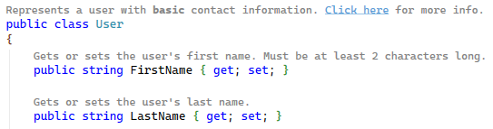
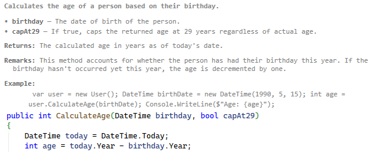
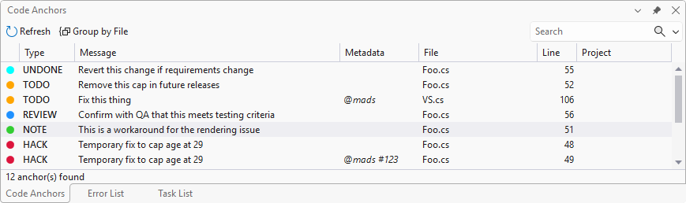
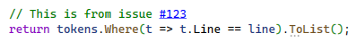

[marketplace]: <https://marketplace.visualstudio.com/items?itemName=MadsKristensen.CommentsVS>
[vsixgallery]: <http://vsixgallery.com/extension/CommentsVS.38981599-e7f2-4db8-bf34-85b325aec2b6/>
[repo]: <https://github.com/madskristensen/CommentsVS>

# Comment Studio for Visual Studio

Download this extension from the [Visual Studio Marketplace][marketplace]
or get the [CI build][vsixgallery].

> 📖 **[Full documentation](docs/README.md)** — detailed guides for every feature.

--------------------------------------

**Stop wrestling with XML documentation comments.** Comment Studio transforms how you write, read, and maintain code documentation in Visual Studio.

## ✨ Key Features at a Glance

- **[Rendered Comments](docs/rendering.md)** — View XML docs as clean, formatted text (no XML noise)
- **[Markdown Support](docs/rendering.md#markdown-formatting-in-comments)** — Use `**bold**`, `*italic*`, `` `code` ``, and `[links](url)` in comments
- **[Auto-Reflow](docs/reflow.md)** — Automatically wrap comments to your preferred line length
- **[Collapse/Expand](docs/outlining.md)** — Hide comment blocks to focus on code, expand when needed
- **[Color-coded Anchor Tags](docs/comment-tags.md)** — TODO, HACK, BUG, FIXME, NOTE highlighted in distinct colors, plus custom tags
- **[Better Comments Style](docs/comment-tags.md#prefix-based-comment-highlighting)** — Prefix-based highlighting (`!`, `?`, `*`, `//`, `-`, `>`) for visual differentiation
- **[Solution-Wide Code Anchors](docs/code-anchors.md)** — Browse all TODOs, HACKs, and notes across your entire solution
- **[Clickable Issues](docs/issue-links.md)** — `#123` links directly to GitHub/GitLab/Azure DevOps issues
- **[Link Anchors](docs/link-anchors.md)** — Navigate to other files, lines, or named anchors with `LINK:` or uppercase `LINK` syntax
- **[Comment Remover](docs/comment-remover.md)** — Bulk remove comments with smart preservation options
- **Theme-aware** — Works with light and dark Visual Studio themes

**Supports:** C#, VB.NET, F#, C++, TypeScript, JavaScript, Razor, SQL, and PowerShell

### Rendered Comments

See your documentation, not the XML. The Full rendering mode strips away XML noise and displays your docs with proper formatting.

### Color-Coded Tags & Better Comments

TODO, HACK, BUG, NOTE, and more are highlighted with distinct colors. Uppercase tags can be written bare (`TODO fix this`); lowercase or mixed-case tags require `:` or `!` (`todo:` or `Todo!`). Prefix-based highlighting (`!`, `?`, `*`, `//`) provides additional visual differentiation.

### Code Anchors

Track all your TODOs, HACKs, and notes across your entire solution in one tool window.

### Issue Links & Link Anchors

`#123` references become clickable links to GitHub, GitLab, Bitbucket, or Azure DevOps. `LINK:` syntax lets you navigate to files, lines, and named anchors; uppercase `LINK` may also be used without a delimiter.

## Why Comment Studio?

XML documentation comments are essential for IntelliSense and API documentation, but they come with frustrations:

- **Hard to read** – XML tags clutter the actual documentation content
- **Tedious to format** – Manual line wrapping and alignment is time-consuming
- **Visual noise** – Long comment blocks obscure the code you're trying to read
- **Easy to miss important notes** – TODO and HACK comments blend into the code

Comment Studio solves all of these problems, letting you focus on writing great documentation instead of fighting with formatting.

## Getting Started

1. Install the extension from the [Visual Studio Marketplace][marketplace]
2. Open any C# or VB.NET file with XML documentation comments
3. **Try rendering modes** – Use **Edit > Comments** to switch between Off, Compact, and Full rendering
4. **Try reflow** – Edit a comment and use **Format Document** (Ctrl+K, Ctrl+D) to see automatic formatting
5. **Try collapsing** – Press **Ctrl+M, Ctrl+C** to collapse all comments and focus on code

## Documentation

| Topic | Description |
|-------|-------------|
| [Comment Rendering](docs/rendering.md) | Rendering modes, rendered XML docs, Markdown formatting |
| [Comment Reflow](docs/reflow.md) | Auto-reflow, Format Document integration, Smart Paste |
| [Comment Outlining](docs/outlining.md) | Collapse and expand XML doc comments |
| [Comment Tags](docs/comment-tags.md) | Color-coded tags, custom tags, prefix-based highlighting |
| [Code Anchors](docs/code-anchors.md) | Solution-wide Code Anchors tool window |
| [Issue Links](docs/issue-links.md) | Clickable `#123` issue references |
| [Link Anchors](docs/link-anchors.md) | `LINK:` navigation syntax |
| [Comment Remover](docs/comment-remover.md) | Bulk comment removal commands |
| [Settings](docs/settings.md) | All options and `.editorconfig` support |
| [Fonts & Colors](docs/fonts-and-colors.md) | Customizable Fonts & Colors reference |

## Feature Requests Addressed

This extension implements functionality requested by users on the Visual Studio Developer Community:

- [Option to highlight TODO comments in the editor](https://developercommunity.visualstudio.com/t/Option-to-highlight-TODO-comments-in-the/1231593)
- [Different types of comments](https://developercommunity.visualstudio.com/t/Different-types-of-comments/10453774)
- [Color the TODO comment so it is different](https://developercommunity.visualstudio.com/t/Color-the-TODO-comment-so-it-is-differe/10375426)
- [Enable links in comments that are relative](https://developercommunity.visualstudio.com/t/Enalble-links-in-comments-that-are-relat/859567)
- [Support for showing rendered documentation comments](https://developercommunity.visualstudio.com/t/Support-for-showing-rendered-documentati/10247122)
- [Support TODO comments in Visual Studio](https://developercommunity.visualstudio.com/t/Support-TODO-comments-in-Visual-Studio-D/1150894)

## How can I help?

If you enjoy using the extension, please give it a ★★★★★ rating on the [Visual Studio Marketplace][marketplace].

Should you encounter bugs or have feature requests, head over to the [GitHub repo][repo] to open an issue if one doesn't already exist.

Pull requests are also very welcome, as I can't always get around to fixing all bugs myself. This is a personal passion project, so my time is limited.

Another way to help out is to [sponsor me on GitHub](https://github.com/sponsors/madskristensen).
