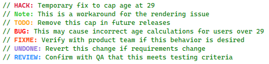
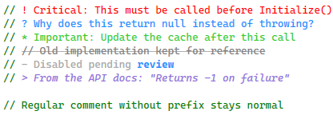

# Comment Tags

Comment Studio highlights comment tags like TODO, HACK, NOTE, and more with distinct colors, making important annotations impossible to overlook. It also supports prefix-based highlighting inspired by the "Better Comments" concept.

## Color-Coded Comment Tags

Comment tags are automatically highlighted with distinct colors. Hover over any tag to see a tooltip explaining its semantic meaning.

Tags may be written in either of these forms:

- **All uppercase:** delimiter is optional, so `TODO fix this`, `TODO: fix this`, and `TODO! fix this` all match.
- **Lowercase or mixed case:** `:` or `!` is required, so `todo: fix this` and `Todo! fix this` match, but `todo fix this` does not.

This keeps common uppercase comments working while avoiding false positives in natural-language comments such as `// review this tomorrow`.

| Tag | Default Color | Description |
|-----|---------------|-------------|
| TODO | Orange | Tasks to be completed |
| HACK | Crimson | Temporary workarounds |
| NOTE | Lime Green | Important notes |
| BUG | Red | Known bugs |
| FIXME | Orange Red | Code that needs fixing |
| UNDONE | Purple | Incomplete work |
| REVIEW | Dodger Blue | Code needing review |

Colors can be customized via **Tools > Options > Environment > Fonts and Colors** under "Comment Tag - [TAG]" entries.



## Custom Tags

Define your own comment tags to match your team's workflow. Add custom tags in **Tools > Options > CommentsVS > Comment Tags** as a comma-separated list:

```text
PERF, SECURITY, DEBT, REFACTOR, WIP, DEPRECATED
```

Custom tags are highlighted in **Goldenrod** and appear in the [Code Anchors](code-anchors.md) tool window alongside built-in tags. All custom tags share a single color, which can be customized via **Tools > Options > Environment > Fonts and Colors** under "Comment Tag - Custom".

The same delimiter rule applies to custom tags: uppercase custom tags may be bare, while lowercase or mixed-case custom tags require `:` or `!`.

Hover over any custom tag to see a QuickInfo tooltip identifying it as a custom anchor with a link to the Code Anchors window.

### Example

```csharp
// PERF: Consider caching this result
// SECURITY: Validate user input before processing
// DEBT: Extract this into a separate service
```

## Tag Prefixes

Some developers prefix their comment tags with a character like `@` or `$` to make them easier to search for (e.g., `// @TODO` instead of `// TODO`). Comment Studio recognizes these prefixes and treats them as equivalent to the unprefixed tag.

Configure prefixes in **Tools > Options > CommentsVS > Comment Tags > Tag prefixes** as a comma-separated list of single characters. The default is `@, $`.

### Example

```csharp
// @TODO: This is treated the same as // TODO
// $HACK: This works too
```

### Prefix Behavior

- **Classification** — The prefix character is highlighted with the same color as the tag
- **Code Anchors** — Prefixes are stripped from display, so `@TODO` appears as `TODO`
- **LINK support** — Prefixes also work with `LINK:` syntax (e.g., `// @LINK: file.cs`)

## Tag Metadata

You can optionally include metadata right after the tag name to make the tooltip more informative.

### Supported Forms

- **Owner:** `TODO(@mads): Refactor this`
- **Issue reference:** `TODO[#1234]: Follow up`
- **Due date (ISO date):** `TODO(2026-02-01): Remove workaround`

### Combining Metadata

You can combine multiple tokens inside the same `(...)` or `[...]` section:

- `TODO(@mads, #1234, 2026-02-01): Refactor this`
- `TODO[@mads #1234 2026-02-01]: Refactor this`

### Notes

- Due dates must be formatted as `yyyy-MM-dd`.
- Tokens are separated by spaces, commas, or semicolons.
- Only `@owner`, `#issue`, and `yyyy-MM-dd` tokens are currently recognized.

## Prefix-Based Comment Highlighting

Inspired by the popular "Better Comments" extension, Comment Studio highlights comments differently based on their prefix character:

| Prefix | Color | Style | Purpose |
|--------|-------|-------|---------|
| `// !` | Red | Normal | Alerts and warnings |
| `// ?` | Blue | Normal | Questions and queries |
| `// *` | Green | Normal | Important highlights |
| `// //` | Gray | Normal* | Deprecated/old code |
| `// -` | Dark Gray | Normal | Disabled/removed |
| `// >` | Purple | Italic | Quotes and references |

*\*Strikethrough can be enabled via **Tools > Options > Environment > Fonts and Colors** under "Comment - Strikethrough (//)". Check the Strikethrough checkbox to apply the effect.*



The feature can be enabled/disabled in **Tools > Options > CommentsVS > Comment Tags**. Colors can be customized under "Comment - [Type]" entries in Fonts and Colors.

Works with `//` (C#), `#` (Python, PowerShell), and `'` (VB.NET) comment styles.

## Related

- [Settings — Comment Tags](settings.md#comment-tags)
- [Fonts & Colors — Comment Tags](fonts-and-colors.md#comment-tags-anchors)
- [Fonts & Colors — Prefix-Based Comments](fonts-and-colors.md#prefix-based-comments-better-comments-style)
- [Code Anchors](code-anchors.md)
