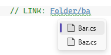

# Link Anchors

Create clickable links in comments that navigate to other files, specific lines, or named anchors within your codebase.

## Basic Syntax

```csharp
// LINK: path/to/file.cs                    // Opens file
// LINK path/to/file.cs                     // Uppercase LINK can omit the delimiter
// link: path/to/file.cs                    // Lowercase/mixed-case LINK requires : or !
// LINK: ./relative/path/file.cs            // Relative path from current file
// LINK: ../sibling/folder/file.cs          // Parent-relative path
// LINK: /solution/root/file.cs             // Solution-relative path (starts with /)
// LINK: @/project/root/file.cs             // Project-relative path (starts with @/)
// LINK: images/Add group calendar.png      // File paths can contain spaces
```

Uppercase `LINK` can be written with or without `:`/`!`. Lowercase or mixed-case forms such as `link` or `Link` require `:` or `!` to avoid matching ordinary prose.

## Line Number Links

```csharp
// LINK: Services/UserService.cs:45         // Opens file at line 45
// LINK: Database/Schema.sql:100-150        // Opens file, navigates to line range
```

## Anchor Links

```csharp
// LINK: Services/UserService.cs#validate-input    // Jump to named anchor in file
// LINK: #local-anchor                             // Jump to anchor in current file
// LINK: ./file.cs:50#section-name                 // Line number + anchor
```



## Features

- **Underlined links** — Only the file path/anchor is underlined (not "LINK:")
- **Hover tooltips** — See the resolved file path and validation status
- **Ctrl+Click navigation** — Jump directly to the target file, line, or anchor
- **Line range selection** — Links with ranges (`:10-20`) select the entire range
- **Non-text files** — Images, PDFs, etc. open with their default application
- **IntelliSense** — Get completions for file paths and anchor names
- **Validation** — Warning squiggles appear for broken links (missing files)
- **Path resolution** — Supports relative (`./`, `../`), solution-relative (`/`, `~/`), and project-relative (`@/`) paths
- **Spaces in paths** — File names with spaces are fully supported

## Combining with ANCHOR Tags

Link anchors work with the existing [ANCHOR tags](code-anchors.md#anchor-tags) to create a navigation system within your codebase:

```csharp
// In UserService.cs:
// ANCHOR(validate-input): Input validation logic

// In another file:
// See input validation: LINK: Services/UserService.cs#validate-input
```

## Related

- [Code Anchors — ANCHOR Tags](code-anchors.md#anchor-tags)
- [Comment Tags — Tag Prefixes](comment-tags.md#tag-prefixes) (prefixes also work with LINK:)
