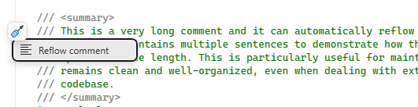

# Comment Reflow

Comment Studio automatically reformats XML documentation comments to fit within a configurable line length, so you never need to manually wrap lines again.

## Automatic Comment Reflow

The extension intelligently wraps text while preserving XML structure. The default maximum line length is **120 characters**, configurable via [settings](settings.md#comment-reflow).

## Format Document Integration

When you use **Format Document** (`Ctrl+K, Ctrl+D`) or **Format Selection** (`Ctrl+K, Ctrl+F`), all XML documentation comments in scope are automatically reflowed to your configured line length.

## Smart Paste

Paste text into an XML documentation comment, and the extension automatically reflows the entire comment block to maintain proper formatting.

## Auto-Reflow While Typing

As you type in an XML documentation comment, the extension automatically reflows the text when a line exceeds the maximum length. This happens seamlessly with a slight delay (300ms) after you stop typing, ensuring no characters are swallowed.

## Light Bulb Action

Place your cursor inside any XML documentation comment and press **Ctrl+.** to see the "Reflow comment" action.

## Related

- [Settings — Comment Reflow](settings.md#comment-reflow)
