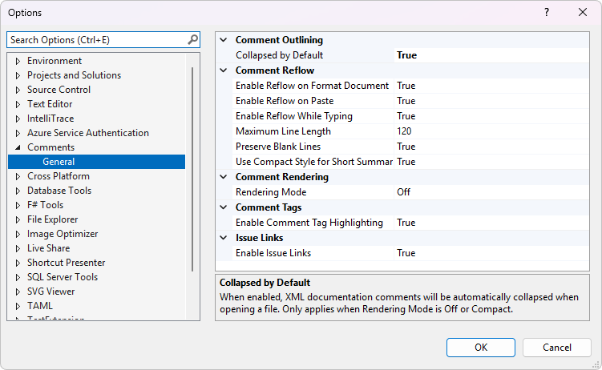
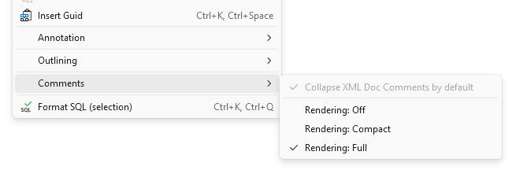

# Settings

Configure Comment Studio via **Tools > Options > CommentsVS**.



## Comment Reflow

| Setting | Default | Description |
|---------|---------|-------------|
| Maximum Line Length | 120 | Maximum line length for reflowed comments |
| Enable Reflow on Format Document | On | Reflow comments when formatting document/selection |
| Enable Reflow on Paste | On | Reflow comments when pasting into comment blocks |
| Enable Reflow While Typing | On | Automatically reflow when line exceeds max length while typing |
| Use Compact Style for Short Summaries | On | Use single-line format for short summaries |
| Preserve Blank Lines | On | Keep intentional blank lines in comments |

## Comment Outlining

| Setting | Default | Description |
|---------|---------|-------------|
| Collapsed by Default | Off | Automatically collapse XML doc comments when opening files (only applies when Rendering Mode is Off or Compact) |

## Comment Rendering

| Setting | Default | Description |
|---------|---------|-------------|
| Rendering Mode | Off | Controls how XML doc comments are displayed: Off (raw XML), Compact (outlining with stripped tags), or Full (rich formatted rendering) |

Rendered comment colors can be customized via **Tools > Options > Environment > Fonts and Colors** under "Rendered Comment - [Type]" entries (Text, Heading, Code, Link). See the full [Fonts & Colors reference](fonts-and-colors.md).

## Comment Tags

| Setting | Default | Description |
|---------|---------|-------------|
| Enable Comment Tag Highlighting | On | Enable/disable tag highlighting |
| Enable Prefix Highlighting | On | Enable/disable prefix-based comment highlighting (Better Comments style) |
| Custom Tags | (empty) | Comma-separated list of custom tags to highlight (e.g., PERF, SECURITY, DEBT) |
| Tag Prefixes | @, $ | Comma-separated list of optional prefix characters for comment tags |

Tag colors can be customized via **Tools > Options > Environment > Fonts and Colors** under "Comment Tag - [TAG]" entries. Custom tags share a single color under "Comment Tag - Custom". Prefix colors can be customized under "Comment - [Type]" entries.

Anchor tag detection is case-aware: uppercase tags may be written without a delimiter (`TODO fix this`), while lowercase or mixed-case tags require `:` or `!` (`todo: fix this`, `Todo! fix this`).

## Code Anchors

| Setting | Default | Description |
|---------|---------|-------------|
| Scan Solution on Load | On | Automatically scan the solution for anchors when opening the Code Anchors tool window |
| File Extensions to Scan | .cs, .vb, .js, .ts, ... | Comma-separated list of file extensions to include when scanning |
| Folders to Ignore | node_modules, bin, obj, ... | Comma-separated list of folder names to skip during scanning |

## Issue Links

| Setting | Default | Description |
|---------|---------|-------------|
| Enable Issue Links | On | Make #123 references clickable links to issues |

## .editorconfig Support

Comment Studio respects `.editorconfig` files for per-project or per-folder configuration. The following properties can be set in your `.editorconfig` to override the global Options page settings:

| Property | Description |
|----------|-------------|
| `max_line_length` | Standard EditorConfig property. Sets the maximum line length for comment reflow. |
| `custom_anchor_tags` | Comma-separated list of custom anchor tags to highlight (e.g., `PERF, SECURITY`). |
| `custom_anchor_tag_prefixes` | Comma-separated list of optional prefix characters for comment tags (e.g., `@, $`). |

### Example .editorconfig

```ini
[*.cs]
max_line_length = 100
custom_anchor_tags = PERF, SECURITY, DEBT, REFACTOR
custom_anchor_tag_prefixes = @, $
```

> **Note:** `.editorconfig` values take precedence over the global settings in **Tools > Options > CommentsVS**. This allows different projects to have different settings without changing your global preferences.

## Context Menu & Keyboard Shortcuts

Right-click in any C#, VB, or C++ code editor to access the **Comment Studio** submenu with quick access to:

- **Expand/collapse XML Doc Comments** — Toggle visibility of all XML doc comments (**Ctrl+M, Ctrl+C**)
- **Collapse XML Doc Comments by Default** — Toggle automatic collapsing
- **Rendering: Off / Compact / Full** — Switch between rendering modes
- **Settings...** — Open extension settings

The same menu is also available from the **Edit** menu.


